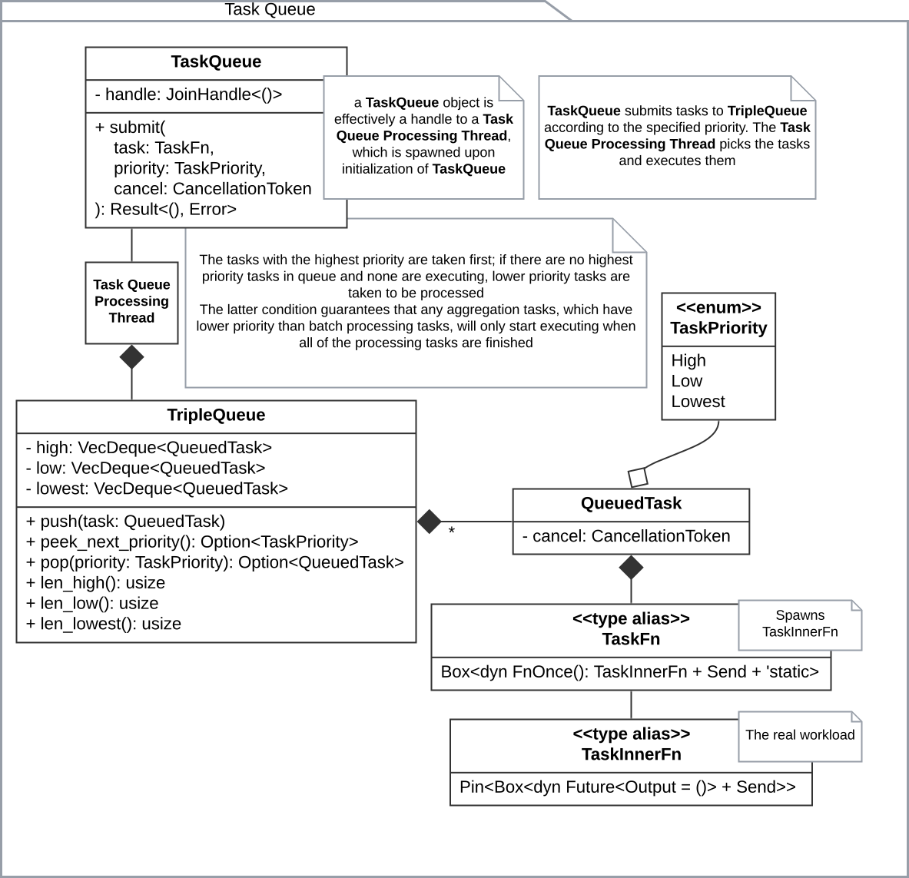

# Photos App — a desktop Photo Library app \[work in progress 🏗️\]

Photos App is a desktop application for managing and viewing your photo library. The idea of the project came from the fact, that Mac's Photos app doesn't analyze the libraries if they are on external drives. To solve this problem, I decided to create my own photo library app that can analyze and manage photos on external drives.

# Building and Running

To build and run the Photos App, you need to have Rust installed on your system. You can install Rust from [rustup.rs](https://rustup.rs/).

Then build according to the instructions:

```bash
git clone https://github.com/misha-kis/photos.git
cd photos
cargo build --release
```

Run the app with:

```bash
cargo run --release
```

After that, you will be able to select a directory for your first photo library and start using the app.

# Architecture

The app uses a hexagonal architecture, where Application (crates/photos-app) is the core, and it depends on and wires together other components: Filesystem Image Repository (crates/photos-infra-fs-repository), Metadata Repository (crates/photos-infra-sqlite-image-metadata-repository), CV Services (crates/photos-infra-cv), etc.

For the UI, I used [egui](https://github.com/emilk/egui). It works for now, but sometime in the future I want to try something else, currently I'm thinking about `iced` (mainly because of its async support). That said, UI is the hardest part for me, so I will probably stick with `egui` for a while.

Here is the component diagram of the app:


### Task management

First of all, the app needs to do a lot of different things: render the thumbnails and originals, import photos, analyze photos in the background, aggregate metadata, etc. All of that needs to be done in a way, that keeps the UI responsive, that allows to add new features, and that allows to use parallelization effectively.

At first, I thought about processing background and UI-related tasks separately to avoid handling task priorities, but I figured out that I would need one anyway, since even background tasks can have different priorities (for example, import > background analysis).

So I decided to stick with a common task system for everything that the app does. The task system is based on three task queues for different priority levels. The diagram of the task system is shown below:



This system handles different priority levels and task parallelization. Now to make implementing new features easier, I added a trait system, which allows to define new task types easily.

First, there are two foundational traits: `OneshotDispatchable` and `Dispatchable`. The former is used for UI tasks, which have a result that needs to be sent back to the UI, while the latter is used for background tasks, which don't have an immediate UI result.

Then, we have complex pipelines of tasks, for example, when analyzing the images, we first need to know, which images to analyze, then process them, and probably aggregate the results. Or spin up another job, for example, a different stage of processing. This is why the Expand-Map-Reduce system was born.

> I don't know, how real developers call this, so I ended up with this term

The basis is like that:

1. `Expand<I, O>`: one `I` → many `O`
1. `Map<I, O>`: one `I` → one `O`
1. `Reduce<I, O>`: many `I` → one `O`

Thus, a chain of Expand, Map, and Reduce makes a "one `I` → one `O`" task too.

`Map<I, O>` implements `OneshotDispatchable<I, O>` to allow for UI tasks with `Map` trait.

`ExpandMapReduce<I, M1, M2, ()>` implements `Dispatchable<I, ()>` for dispatching mass processing jobs. To allow job chaining, `(Arc<J1>, Arc<J2>) where J1: Dispatchable<I, ()>, J2: Dispatchable<(), ()>` implements `Dispatchable<I, ()>` too.


### ML

Right now the app supports face detection and creating embeddings for faces. This (theoretically) allows to make clusters of faces and add make photo collections based on the people in the pictures.

In reality, there is a lot of work to do either with clustering algorithm, or with embedding model, because right now clustering is far from perfect.

The current version uses

- [yolo-face](https://github.com/akanametov/yolo-face) for face detection
- [facenet](https://github.com/davidsandberg/facenet) for creating the embeddings
- HDBSCAN for clustering
